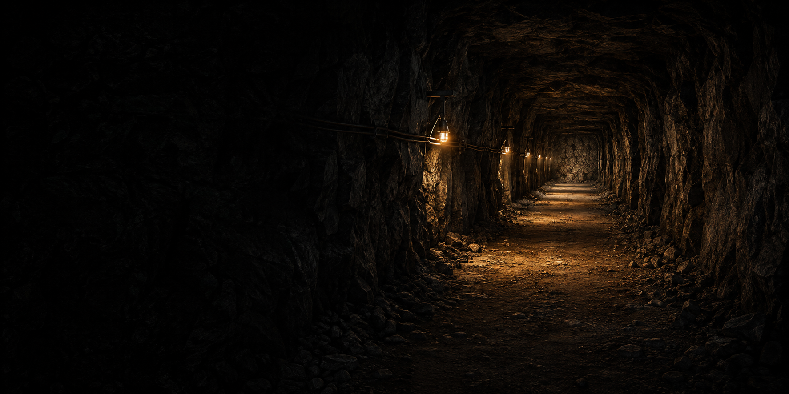

# hanshino-cave-autodig



Automates digging in [The Cave](https://mods.factorio.com/mod/the-cave) at exactly manual
speed. This document exists so the next person (possibly future-you) does not have to
re-derive the dead ends this project already walked into. Read it before changing anything,
especially the mining-speed formula and the mining mechanism.

## What problem this solves

The Cave's core loop is: walk up to a rock/rubble tile, click it, wait for it to mine, repeat
— for as long as you want to dig a tunnel or clear an area. That is a lot of repetitive
clicking with no decision content. This mod automates exactly that click, nothing more: it
does not mine faster, reach further, or generate different outcomes than clicking would. See
`portal-description.md` for the player-facing version of this guarantee.

## Why `mine_entity` is the only viable mechanism

Two other approaches look plausible and are both dead ends. This was the single most
expensive thing to establish in this project, so the evidence is recorded here in full.

**Bots cannot dig the wall.** The-cave's frontier rock is script-spawned and explicitly marked
non-deconstructable:

```
prototypes/rock.lua:6
rock.flags = { "placeable-neutral", "not-deconstructable" }
```

There is no deconstruction-order path around this flag. A bot-based "auto-dig" is not
possible against `diggy-rock` at all.

**Damage-based destruction (turrets, explosives, anything that isn't a direct player click)
yields nothing.** The-cave's dig handler decides what a destroyed rock produces based on how
it died:

```
control.lua:484-501
local player_mined_directly = event.name == defines.events.on_player_mined_entity
    and event.player_index ~= nil
local player_mined_rock_directly = player_mined_directly
    and entity.name == "diggy-rock"
local dig = {
    ...
    -- Direct player mining is the only action allowed to resolve seeded
    -- dig outcomes. Non-player destruction (especially Demolisher movement)
    -- is geometry-only: it removes the rock in its path but cannot generate
    -- caverns, rooms, enemies, resources, treasure, threats or discoveries.
    direct_player_mining = player_mined_directly,
    allow_hostile_spawns = player_mined_rock_directly,
    allow_room_generation = player_mined_rock_directly,
    allow_dig_outcomes = player_mined_rock_directly,
}
```

`allow_dig_outcomes` (resources, caverns, rooms, spawns, discoveries — everything a real dig
produces) is only ever `true` when the rock died via `on_player_mined_entity` with a real
`player_index`. Any other kind of removal — including the maintainer's own scripted-digging
simulation:

```
scripts/sim.lua:247
entry[1].die(s.force_name)
```

— takes the geometry-only branch: the rock disappears, but no resources, no cavern, nothing.
An "auto-dig" built on damaging or otherwise destroying the entity (turret fire, explosives,
`entity.destroy()`, etc.) would silently produce a tunnel with zero yield. This is why the
entire mod is built around calling `LuaEntity::mine_entity` from real player code — it is the
only removal path that sets `player_mined_rock_directly = true`.

## Forward mode: two verified assumptions it depends on

Two facts turned out to be load-bearing for forward mode and were measured in-game rather than
assumed. Recording them here so nobody re-derives (or re-doubts) either one.

**`walking_state.walking` stays `true` while the character is blocked against a wall.**
Verified in-game 2026-07-27. It reflects input intent, not actual displacement, so a player
holding a movement key into solid rock still reads as "walking" every tick. This is the entire
reason forward mode can work at all — without it, `logic.walk_active` would go stale the
instant the character stopped moving, and forward mode could never advance past the first tile
of any wall. `WALK_GRACE_TICKS` (`src/control.lua`) exists for an independent reason on top of
this fact, not as insurance against it turning out false — it also has to make digging stop
within half a second of the key being released; see the comment there.

**`LuaEntity::mine_entity` does not enforce reach.** Measured on a throwaway Factorio 2.0.77
server: entities at 9.19, 10.19, and 20.00 tiles were all mined successfully via `mine_entity`
while `player.can_reach_entity(entity)` reported `false` for that same entity at that same
distance. `mine_entity` mines whatever it's handed, regardless of distance. This is why the
`player.can_reach_entity` check inside `forward_target` and `cursor_target` is the **only**
distance guard anywhere in this mod — it is load-bearing, not defensive, and must never be
removed, weakened, or short-circuited.

`diggy-rock` resolves its reach through `resource_reach_distance`, not the more common
`reach_distance` — the two are separate character stats. The Cave's 10-level reach research
raises both by +2 per level, so the effective reach for `diggy-rock` starts around 3.2 tiles at
season start and reaches roughly 23 tiles fully researched. The check region is circular
(Euclidean), measured to the nearest point of the target's collision box, not tile-center to
tile-center — which is why `can_reach_entity` is asked directly rather than this mod ever
computing or hardcoding a distance itself.

## The multiplicative mining-speed formula

`mining_speed_for` in `src/control.lua` computes:

```lua
base * (1 + player.character_mining_speed_modifier)
     * (1 + player.force.manual_mining_speed_modifier)
```

This is **multiplicative**, not additive, confirmed by two independent sources:

- `LuaForce.manual_mining_speed_modifier`'s own API doc: "actual mining speed will be
  multiplied by `1 + manual_mining_speed_modifier`".
- The wiki's hand-mining formula: `(1 + Force Modifier) * (1 + Character Modifier) *
  (Character mining speed) / Mining time`.

Writing it as `(1 + character_bonus + force_bonus)` is only correct when one of the two
bonuses is exactly zero — an early draft of this mod did exactly that, and it was caught and
fixed during Task 7's review before it shipped. With both bonuses non-zero the additive form
underestimates effective speed (auto-dig would be slower than manual mining), and the same
error direction applies to any future combination where more than one modifier is active. Do
not "simplify" this back to addition — it looks harmless and is wrong.

## Charge-then-dig: why the first dig used to be free

Until 0.2.1, `try_dig` called `player.mine_entity` **first** and only then set
`s.next_tick = game.tick + cooldown`. Steady-state throughput was correct — one rock per
cooldown forever — but the very first dig of a run happened immediately, with no wait at all.
Manual mining is "hold the button for `mining_time` seconds, *then* the rock breaks", so the
old order handed out one entire cooldown for free at the start. Reported by The Cave's author.

This matters more than the arithmetic suggests. The mod's whole pitch (`portal-description.md`,
and the opening of this README) is that it changes *nothing* about pace. A player who toggles
auto-dig on and off repeatedly — which costs nothing, since `next_tick` is deliberately
preserved across a toggle — was not exploiting anything, but the invariant as literally stated
was false, and "it evens out over time" is not the guarantee that was made.

The fix inverts the order into a **charge model**:

1. Find a target. Build a stable key for it (see below).
2. If that key is not the one already being charged, store it, set
   `next_tick = game.tick + cooldown`, and **do not mine this round**.
3. When the cooldown expires, find a target again *from scratch*.
4. If it is still the same key, mine it and clear the charge. If it is a different key, start
   charging the new target instead — i.e. a full fresh cooldown.

Step 3 re-running the search (rather than caching the `LuaEntity` from step 1) is deliberate:
the entity may have been mined by another player, destroyed by a collapse, or walked out of
reach during the cooldown, and a stored `LuaEntity` would be stale or invalid. Re-searching
also means the mode's own targeting rules (cursor's `player.selected`, forward's candidate
ordering, clear's nearest-reachable) get the final say at the moment of the dig, not a
cooldown earlier.

**Target identity is a coordinate+name string, not `unit_number`.** `diggy-rock` is very
likely a `simple-entity` prototype, and that class is not guaranteed to carry a `unit_number`
at all — reading it can yield `nil`. A `nil` key would fail every comparison, so charging
would never complete and *no rock would ever be mined*, with no error message anywhere. The
key is therefore `logic.target_key(x, y, name)` → `"10,20,diggy-rock"`: The Cave pins cover
entities to tile centers and they never move, so the key is stable for as long as the rock
exists, and it is derived from synchronized entity state so every machine in a multiplayer
game computes the same string. `string.format("%d")` is used rather than `..` concatenation
because `math.floor` returns a float in Lua 5.2 and an integer in 5.3+, and the two do not
`tostring` identically.

**The known, accepted cost: about one extra tick per rock**, because charging for the next
rock cannot begin until the tick after the previous one was mined. That is roughly 0.5% below
the theoretical manual-mining rate. This is deliberately not hidden in the changelog: the error
is in the safe direction, and "slightly slower than hand mining" is a far cheaper bug than
"slightly faster", which is the one thing this mod promises never to be.

**Charge state lifecycle** (`s.charging_key`, stored per-player alongside `next_tick` and
`enemy_count`):

- Set when charging starts; compared on the next eligible tick; cleared after a successful
  mine, when the target disappears, and on every path that disables auto-dig (`stop()`, the
  hotkey toggle, the GUI checkbox).
- **Cleared on toggle — the opposite of `next_tick`, and both are correct.** `next_tick` is
  deliberately *not* reset when auto-dig is switched on, because resetting it would make
  double-tapping the hotkey a way to skip the cooldown. `charging_key` deliberately *is*
  cleared, because *keeping* it would be that same exploit: a player standing still, aimed at
  the same rock, would re-enable and find the charge already satisfied and mine instantly —
  crediting a charge accumulated before the mod was switched off, however long ago. Both rules
  point the same way: re-enabling must never be faster than leaving it on.
- Missing on old saves (pre-0.2.1) reads as `nil`, which is exactly the safe default, so
  `on_configuration_changed` deliberately does **not** backfill it — same reasoning as
  `enemy_count`. Backfilling any string would risk a fabricated key matching a real target and
  granting one un-charged dig.

**Safety gates still run only at the moment of the mine**, not at charge start. Two reasons:
pre-0.2.1 they only ran at mine time, so keeping that is not a regression; and a stress reading
taken a full cooldown before the dig is stale by the time it matters. Checking at both points
would double this mod's `remote.call` traffic into The Cave — an interface documented as the
maintainer's private test hook (see below) — to buy only "find out one cooldown earlier that
the dig would be blocked".

## Why only clear mode backs off when idle

`CLEAR_IDLE_RETRY_TICKS = 15` in `src/control.lua` applies to **auto-clear mode only**. Before
0.2.1 nothing set a cooldown when no target was found, so a mode that found nothing simply
re-ran its whole search on the very next tick, forever. The three modes' idle costs are orders
of magnitude apart, which is why the backoff is not applied uniformly:

| Mode | Cost of one fruitless scan |
| --- | --- |
| `cursor` | reads `player.selected` — **zero** world queries |
| `forward` | at most 3 `find_entities_filtered` point queries at radius 0.4, and only after `walk_active` passes |
| `clear` | one `find_entities_filtered` over the full `resource_reach_distance` radius (~23 tiles fully researched) **plus a `can_reach_entity` call per result** |

Only the third is worth throttling, and on a multiplayer server it runs once per enabled player
per tick — the author of The Cave reported it as wasted UPS. At 15 ticks (0.25s) an idle
player's scan rate drops to 1/15 while the worst-case delay before a newly-in-range rock starts
being dug is a quarter second, which is not perceptible.

Adding the same backoff to `cursor` would be actively harmful: pointing at a rock and having it
start digging is that mode's entire feel, and a quarter-second of lag on every re-aim is
exactly the kind of sluggishness players notice. `forward` is cheap enough not to bother.

**Why the backoff can never accelerate anything.** It is only reachable inside the branch where
`logic.ready_to_dig` already returned `true` — that is, `game.tick >= s.next_tick` is already
established and the cooldown has already expired. The value written is `game.tick + 15`, which
is therefore necessarily `>= ` the old `s.next_tick`. The assignment can only ever push
`next_tick` later, never earlier, no matter how the constant is tuned. Any future change that
sets `next_tick` outside a `ready_to_dig`-gated branch loses this property and must re-derive
its own argument.

## `logic.lua` / `control.lua` layering, and the zero-Factorio-dependency test

`src/logic.lua` contains every decision function (direction math, forward-candidate ordering,
cooldown math, the safety-gate decision in `blocked_reason`) as pure functions: no `game`,
`storage`, `settings`, `defines`, `prototypes`, `remote`, or `script`. `src/control.lua` is
the thin event-wiring layer that turns real Factorio state into the plain tables `logic.lua`
consumes, and turns its plain-table answers back into API calls.

The reason this split exists: **a headless Factorio server has no player character**, so
`walking_state`, `can_reach_entity`, `mine_entity`, and the GUI event handlers cannot be
exercised outside a real client at all — there is no way to unit-test them. Pulling every
decision that doesn't need those things out into a dependency-free module means that logic can
run under a plain Lua interpreter (`test/run.sh` runs it in `nickblah/lua:5.2` — no Factorio
engine involved) with a real, fast unit test suite (117 assertions as of 0.2.1), instead of
being untestable until someone plays the game.

The charge model added in 0.2.1 was pushed into `logic.lua` for exactly this reason:
`target_key`, `charge_action`, and `idle_retry_ticks` are all decisions that need no world
access, so the "is this still the same rock?" comparison and the per-mode backoff policy are
unit-tested rather than only reachable by playing. `control.lua` keeps what genuinely needs the
engine — reading `entity.position`/`entity.name`, storing `s.charging_key`, and setting
`s.next_tick`.

This boundary is enforced as a test, not just a convention: the last block of
`test/test_logic.lua` strips comments out of `src/logic.lua`'s own source and scans it for the
seven forbidden global names. If anyone ever adds a `game.*` or `storage.*` call to
`logic.lua`, this test fails immediately — instead of the whole module silently becoming
untestable outside the running game with no error telling you why.

## The collapse-stress gate's two unstable, unofficial dependencies

The collapse-stress gate depends on **two** of The Cave's own internals, neither of which is
a guaranteed public API, and each fails in a different way.

**`debug_max_stress`** — the collapse-stress gate calls into The Cave via
`remote.call("diggy-v1", "debug_max_stress", ...)`. This is registered in the-cave's
`control.lua` under the comment:

> Headless test hooks (used by the maintainer's automated benchmarks).

That is not a promise of a stable public API — it is the maintainer's own test/benchmark
plumbing that this mod happens to be able to call too. It can be renamed, restructured, or
removed in any future release of The Cave with no deprecation warning, and there is nothing
this mod can do to prevent that.

**`the-cave-collapse-mode`** — whether the gate runs at all is read from this startup setting
(`collapse_enabled()` in `src/control.lua`). This is ordinary product config, not a debug hook,
which if anything makes it *more* likely to be renamed someday than the remote interface above.
If the setting name disappears, `settings.startup["the-cave-collapse-mode"]` returns `nil` —
indistinguishable, on its own, from a server that deliberately left the gate off. Without
special-casing that, the gate would vanish with no observable difference and no warning.
`collapse_enabled()` therefore returns a second value distinguishing "found, but not enabled"
(normal, silent) from "not found at all" (warned once, see below).

Degradation behavior (`src/control.lua`):

1. Before calling `debug_max_stress`, check that `remote.interfaces["diggy-v1"]` and its
   `debug_max_stress` entry both still exist.
2. Wrap the actual `remote.call` in `pcall` regardless — an interface can exist with an
   incompatible signature.
3. If either check fails, print a **one-time-per-save** warning
   (`autodig.probe-unavailable`, gated on `storage.autodig.probe_warned`) and drop only the
   collapse-stress gate for that dig (`gate_collapse = false`). Auto-dig keeps running; it
   simply stops checking collapse risk until the mod is updated to match whatever The Cave
   changed.
4. If `the-cave-collapse-mode` itself cannot be found, print a separate **one-time-per-save**
   warning (`autodig.collapse-setting-missing`, gated on
   `storage.autodig.collapse_setting_warned`) — same mechanism, independent flag, so the two
   failure modes don't mask or double up on each other.
5. Both warning flags live in `storage`, not a module-local, so "once per save" is literal —
   reconnecting to the same save does not print it again. They are cleared in
   `on_configuration_changed` only when this mod's own version changed (checked against
   `event.mod_changes["hanshino-cave-autodig"]`), so a later update that fixes the detection
   logic — or a Cave update that restores the interface — gets a chance to warn again instead
   of staying latched forever. `player.print` is deliberately not used for either warning: this
   is a server-wide condition, not a personal one, so both use `game.print`.
6. The enemy gate does not depend on either of these and is unaffected either way.

The one thing this mod must never do is let a broken/renamed remote interface turn into an
uncaught Lua error — that would either silently disable auto-dig with a cryptic error popup,
or (worse) crash the whole mod's event handlers for every player. Hence the interface-presence
check *and* the `pcall`, not just one or the other.

## Duplicate-locale-section trap

Both `src/locale/en/autodig.cfg` and `src/locale/zh-TW/autodig.cfg` must each contain exactly
**one** `[autodig]` section (and one of each other section). Factorio's locale loader builds a
property tree per language file where section names are keys at ROOT; a section name that
appears twice in the same file makes the client reject the *entire* language file for that mod
with `Failed to load locale: Duplicate key "..." in property tree at ROOT` — this happened for
real in the sibling `locale-mod` project (see its `README.md` / `CLAUDE.md`) and shipped
undetected for three releases.

It cannot be caught by this project's headless load test (`package.sh`'s `docker run
factoriotools/factorio ... --create`): **a headless server never parses non-`en` locale
files at all**, so a load test proves the prototypes and dependencies are fine and proves
nothing about locale validity. When adding a new player-facing string, always extend the
existing `[autodig]` section — never open a second section with the same name, in either
language file.

## Why `package.sh` copies files by whitelist, not `cp -r`

`package.sh` lists the exact files that go into the zip (`src/info.json src/data.lua
src/settings.lua src/control.lua src/logic.lua src/gui.lua` plus the two locale directories,
plus the repo-root `LICENSE`) instead of recursively copying `src/`. This mirrors a near-miss
in the sibling `locale-mod` project, where a stray `.omc/` tool-state directory got swept into
a build by `cp -r` and nearly got published to the public mod portal. Any new source file must
be added to this whitelist explicitly — an unlisted file is silently left out of the zip, which
is the safe failure direction, but also means "I added a file and it's not in the build" is
usually a forgotten whitelist entry, not a bug in `package.sh`.

`publish.sh` also diffs the zip's contents against `src/` byte-for-byte before letting a
`release`/`init` proceed, so uploading a stale build (packaged from an older `src/`, before the
last few edits) fails loudly instead of quietly shipping code nobody reviewed.

## Console/RCON injection: considered and rejected

Before committing to a mod, injecting `script.on_nth_tick` via RCON directly into the running
server (no mod install, no client download) was evaluated as an alternative. Measured on a
throwaway Factorio 2.0.77 server:

- `script.on_nth_tick` registered from the console *does* fire (observed 8 times in an 8
  second window).
- `storage` is readable and writable from console-injected code, and persists in the save.
- **The handler is lost on every save/load.** There is no way to make console-injected code
  survive a server restart; it would have to be manually re-injected every single time.
- **An `error()` thrown inside the handler kills the server outright**
  (`Quitting: multiplayer error.`) — a single bad edit takes down the whole game for everyone
  connected, with no isolation.
- Measurement trap worth remembering if this is ever re-evaluated: a headless server with no
  connected players auto-pauses, which makes `on_nth_tick` appear not to fire at all (a false
  negative). The fix is `"auto_pause": false` in `server-settings.json`; there is no
  `--no-auto-pause` command-line flag.

This mod was chosen over injection because (a) clients on this server already auto-download
mods from the portal, so per-player cost is close to zero, erasing injection's main
advantage, and (b) the mod path has a pre-flight load test (`package.sh`) that catches broken
prototypes/dependencies before anything reaches the server; there is no equivalent pre-flight
check for injected console code, which fails at runtime with no safety net.

## Testing, packaging, and publishing

```bash
./test/run.sh        # logic.lua's unit tests, in Docker (nickblah/lua:5.2 — matches
                      # Factorio 2.0's embedded Lua 5.2.1; testing under 5.4 would let
                      # 5.3+-only syntax like `//` or bitwise operators pass silently,
                      # and it would only fail once it hit the real game)

./package.sh          # runs test/run.sh, builds dist/<name>_<version>.zip from the
                      # whitelist above, then a headless load test (prototypes/
                      # dependencies only — no runtime behavior; see the Docker
                      # entrypoint note below)

./package.sh --install  # also copies the zip into ../_data/mods/ (chown 845).
                         # Needs ./restart.sh on the server to take effect.

./publish.sh --init            # preview: what a first-ever publish would send
./publish.sh --init --yes      # actually publish (only succeeds once, ever)
./publish.sh --release --yes   # upload a new version (bump info.json's version first)
./publish.sh --details --yes   # update only the portal page copy
```

`publish.sh` defaults to a dry run — nothing is sent without `--yes`. Publishing a mod name is
public and permanent (a taken name can never be renamed), so this default is intentional; do
not "streamline" it away.

### Docker entrypoint gotcha (load test)

`package.sh`'s load test runs:

```
docker run --rm --entrypoint /opt/factorio/bin/x64/factorio \
    -v "$LOADTEST:/mods" factoriotools/factorio:2.0.77 \
    --mod-directory /mods --create /tmp/loadtest.zip
```

The explicit `--entrypoint` is required, not optional convenience: the image's default
`/docker-entrypoint.sh` does not replace itself with the container's CMD — it *appends* CMD as
extra arguments after its own server-start invocation, and it runs as uid `845` (the image's
`factorio` user), `chown`-ing the mounted directory to that uid before doing anything else.
That collides with a host-mounted mods directory (owned by the host user), producing
`Permission denied`. Pointing `--entrypoint` straight at the `factorio` binary skips all of
that setup and runs a clean, one-shot `--create`.

## Manual verification checklist (safety gates)

These are the checks a human needs to run at a real Factorio client after `./package.sh`
installs this build. None of them can be automated — the load test only proves prototypes and
dependencies resolve, not runtime behavior, since a headless server has no player character.

**Precondition for items 1, 2, 3 and 6 (the stress-gate items):** they require
`the-cave-collapse-mode = enabled`. This is a **startup** setting, so it needs a server restart
to take effect, and enabling it turns on real cave collapses — do this on a **throwaway save**,
never on the live season save. On the production server's current configuration
(`the-cave-collapse-mode = disabled`, confirmed against `_data/mods/mod-settings.dat`),
`collapse_enabled()` returns false, `stress_at` is never called, and the whole stress gate
(including item 6's probe-unavailable warning) is dead code — **the enemy guard (items 4 and 5)
is the only safety gate actually running there.** Items 4 and 5 need no special setup and can be
verified on the live server as-is.

1. On an already-cleared, open area near a wall, turn on auto-dig. It should dig only a few
   tiles before printing "應力 X.XX（安全上限 3.00）" ("rock stress X.XX (safety limit 3.00)")
   and stopping.
2. Cross-check the number by hand. The box must be centered on **your own position**, not
   world origin — `stress_at` in `src/control.lua` samples `x ± STRESS_PROBE_HALF` around the
   *target tile*, and a box built from `-4,-4,4,4` only happens to agree with that when digging
   exactly at (0,0); anywhere else it silently checks the wrong area and sends you chasing a
   mismatch that isn't really there. `h` below must match `STRESS_PROBE_HALF` (currently 4):
   ```
   /c local h = 4; local p = game.player.position; local x, y = math.floor(p.x), math.floor(p.y); game.player.print(remote.call("diggy-v1","debug_max_stress", game.player.surface.index, x-h, y-h, x+h, y+h))
   ```
   — confirm the mod's reading is in the same ballpark.
3. Dig a normal single-tile-wide tunnel through ordinary rock — it should **not** be blocked
   (a 1-tile corridor's stress should sit well below 3.0). If it keeps getting blocked, the
   `STRESS_PROBE_HALF` sampling box (currently ±4, a 5x5 area) is likely picking up an existing
   large open cavity nearby; try narrowing it to ±2 and re-test.
4. Dig until a biter/spawner/turret appears nearby — auto-dig should print "附近敵人增加了"
   ("more enemies nearby") and stop.
5. Clear out the enemies near you and turn auto-dig back on — it should resume digging
   normally (this proves the enemy-count baseline tracked the decrease, not just increases).
6. **Simulate The Cave changing its interface:** run
   `/c remote.remove_interface("diggy-v1")`, then keep digging. Expected: exactly one warning
   print, then digging continues normally with the enemy gate only — **no Lua error window**
   may appear. This test permanently breaks The Cave on whatever save it's run on
   (`diggy-v1` is gone for the rest of that session); use a throwaway save and do not save
   over anything you care about afterward.

See the task's brief (`.superpowers/sdd/2026-07-27-cave-autodig-v1/task-10-brief.md`, Step 3)
for the original wording; the six items above are equivalent and self-contained.

## v2 backlog

- **Mode 3 — locked-facing dig**: dig in a direction fixed by the player, independent of
  which way they happen to be walking right now.
- **Mode 4 — area-select dig with pillar reservation**: player marks out a region; auto-dig
  clears it while deliberately leaving a grid of support columns standing (relevant once
  The Cave's collapse system is in play over a large cleared area, not just a single tunnel).

Neither mode is designed yet beyond the name above — that design work is out of scope for this
task.
